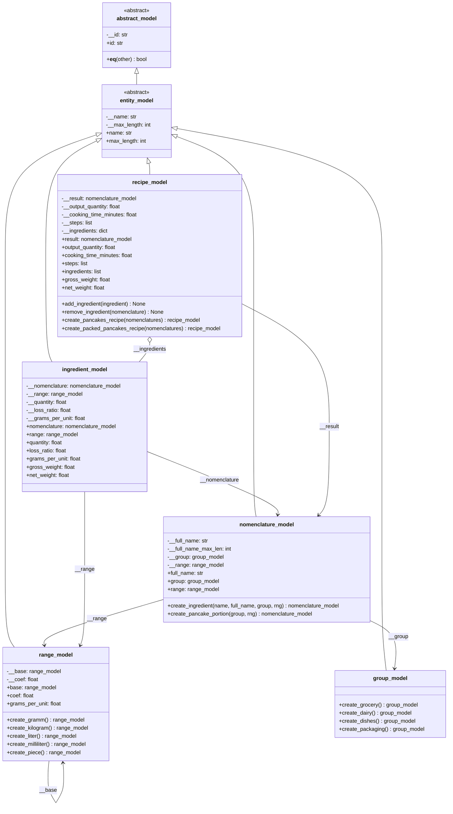

```mermaid
classDiagram

    class abstract_model {
        <<abstract>>
        -__id: str
        +id: str
        +__eq__(other) bool
    }

    class entity_model {
        <<abstract>>
        -__name: str
        -__max_length: int
        +name: str
        +max_length: int
    }

    class range_model {
        -__base: range_model
        -__coef: float
        +base: range_model
        +coef: float
        +grams_per_unit: float
        +create_gramm() range_model
        +create_kilogram() range_model
        +create_liter() range_model
        +create_milliliter() range_model
        +create_piece() range_model
    }

    class group_model {
        +create_grocery() group_model
        +create_dairy() group_model
        +create_dishes() group_model
        +create_packaging() group_model
    }

    class nomenclature_model {
        -__full_name: str
        -__full_name_max_len: int
        -__group: group_model
        -__range: range_model
        +full_name: str
        +group: group_model
        +range: range_model
        +create_ingredient(name, full_name, group, rng) nomenclature_model
        +create_pancake_portion(group, rng) nomenclature_model
    }

    class ingredient_model {
        -__nomenclature: nomenclature_model
        -__range: range_model
        -__quantity: float
        -__loss_ratio: float
        -__grams_per_unit: float
        +nomenclature: nomenclature_model
        +range: range_model
        +quantity: float
        +loss_ratio: float
        +grams_per_unit: float
        +gross_weight: float
        +net_weight: float
    }

    class recipe_model {
        -__result: nomenclature_model
        -__output_quantity: float
        -__cooking_time_minutes: float
        -__steps: list
        -__ingredients: dict
        +result: nomenclature_model
        +output_quantity: float
        +cooking_time_minutes: float
        +steps: list
        +ingredients: list
        +gross_weight: float
        +net_weight: float
        +add_ingredient(ingredient) None
        +remove_ingredient(nomenclature) None
        +create_pancakes_recipe(nomenclatures) recipe_model
        +create_packed_pancakes_recipe(nomenclatures) recipe_model
    }

    abstract_model <|-- entity_model
    entity_model   <|-- range_model
    entity_model   <|-- group_model
    entity_model   <|-- nomenclature_model
    entity_model   <|-- ingredient_model
    entity_model   <|-- recipe_model

    range_model        --> range_model        : __base
    nomenclature_model --> group_model        : __group
    nomenclature_model --> range_model        : __range

    ingredient_model   --> nomenclature_model : __nomenclature
    ingredient_model   --> range_model        : __range

    recipe_model       --> nomenclature_model : __result
    recipe_model       o-- ingredient_model   : __ingredients
```
