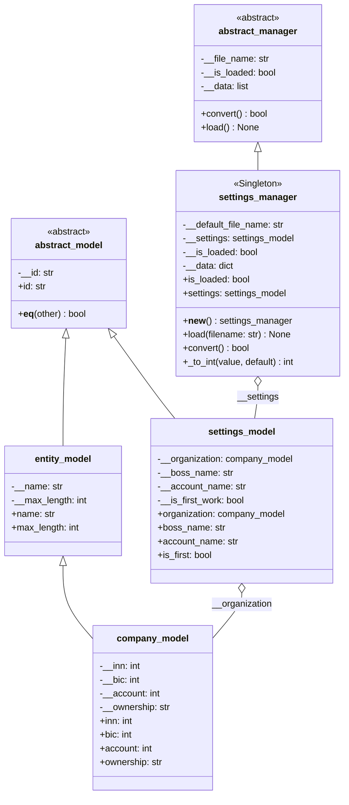

# SettingsManager UML

```mermaid
classDiagram
    class abstract_manager {
        <<abstract>>
        -__file_name: str
        -__is_loaded: bool
        -__data: list
        +convert() bool
        +load() None
    }

    class abstract_model {
        <<abstract>>
        -__id: str
        +id: str
        +__eq__(other) bool
    }

    class entity_model {
        -__name: str
        -__max_length: int
        +name: str
        +max_length: int
    }

    class settings_manager {
        <<Singleton>>
        -__default_file_name: str
        -__settings: settings_model
        -__is_loaded: bool
        -__data: dict
        +__new__() settings_manager
        +load(filename: str) None
        +convert() bool
        +_to_int(value, default) int
        +is_loaded: bool
        +settings: settings_model
    }

    class settings_model {
        -__organization: company_model
        -__boss_name: str
        -__account_name: str
        -__is_first_work: bool
        +organization: company_model
        +boss_name: str
        +account_name: str
        +is_first: bool
    }

    class company_model {
        -__inn: int
        -__bic: int
        -__account: int
        -__ownership: str
        +inn: int
        +bic: int
        +account: int
        +ownership: str
    }

    abstract_manager <|-- settings_manager
    abstract_model   <|-- entity_model
    abstract_model   <|-- settings_model
    entity_model     <|-- company_model

    settings_manager o-- settings_model : __settings
    settings_model   o-- company_model  : __organization
```
