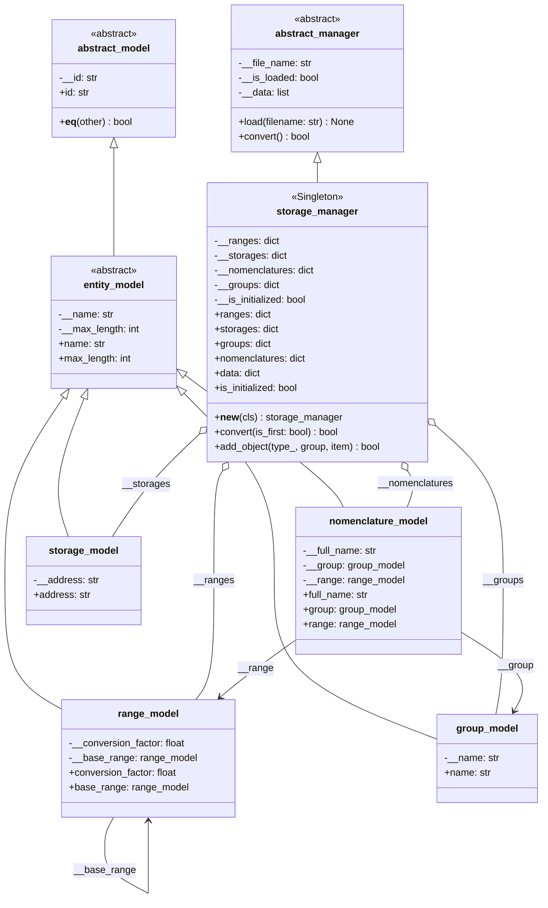

```mermaid
classDiagram

    class abstract_manager {
        <<abstract>>
        -__file_name: str
        -__is_loaded: bool
        -__data: list
        +load(filename: str) None
        +convert() bool
    }

    class abstract_model {
        <<abstract>>
        -__id: str
        +id: str
        +__eq__(other) bool
    }

    class entity_model {
        <<abstract>>
        -__name: str
        -__max_length: int
        +name: str
        +max_length: int
    }

    class storage_manager {
        <<Singleton>>
        -__ranges: dict
        -__storages: dict
        -__nomenclatures: dict
        -__groups: dict
        -__is_initialized: bool
        +__new__(cls) storage_manager
        +convert(is_first: bool) bool
        +add_object(type_, group, item) bool
        +ranges: dict
        +storages: dict
        +groups: dict
        +nomenclatures: dict
        +data: dict
        +is_initialized: bool
    }

    class range_model {
        -__conversion_factor: float
        -__base_range: range_model
        +conversion_factor: float
        +base_range: range_model
    }

    class group_model {
        -__name: str
        +name: str
    }

    class nomenclature_model {
        -__full_name: str
        -__group: group_model
        -__range: range_model
        +full_name: str
        +group: group_model
        +range: range_model
    }

    class storage_model {
        -__address: str
        +address: str
    }

    abstract_manager <|-- storage_manager

    abstract_model <|-- entity_model
    entity_model   <|-- range_model
    entity_model   <|-- group_model
    entity_model   <|-- nomenclature_model
    entity_model   <|-- storage_model

    storage_manager o--  range_model        : __ranges
    storage_manager o-- group_model        : __groups
    storage_manager o-- nomenclature_model : __nomenclatures
    storage_manager o-- storage_model      : __storages

    range_model        --> range_model : __base_range
    nomenclature_model --> group_model : __group
    nomenclature_model --> range_model : __range
```
